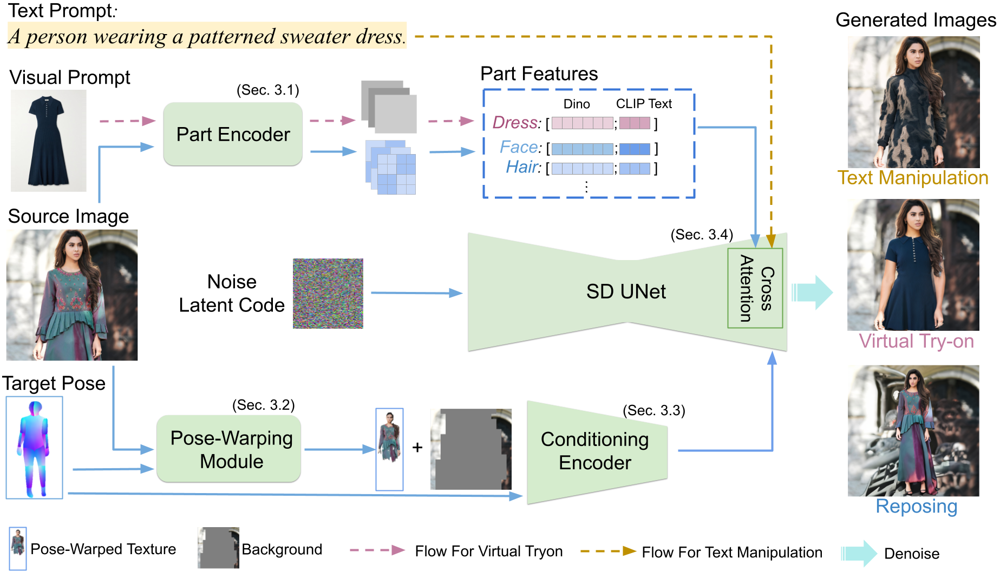
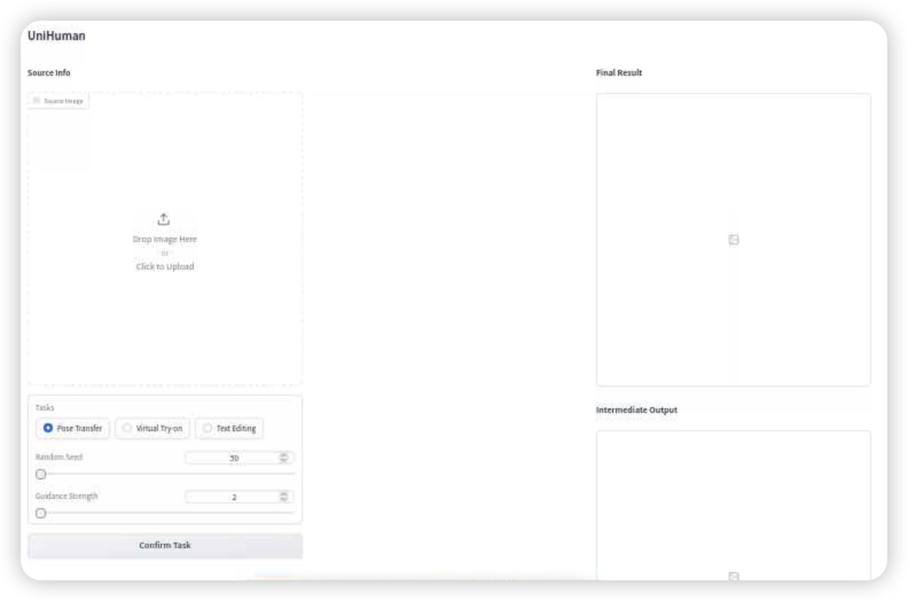

# UniHuman
This repository provides the official code for CVPR 2024 paper [UniHuman: A Unified Model For Editing Human Images in the Wild](https://arxiv.org/abs/2312.14985). This work was conducted during Nannan Li's Summer 2023 internship at Adobe Research.


## 1. Overview

<p align="center">

</p>

This repo provides the source code for UniHuman, a model that leverages multiple data sources and connections between related tasks to achieve high-quality results across various human image editing objectives. For users who would like to try our pretrained model, please set up the environment according to [Section 2: Environment Requirements](#env-require), and run the program as instructed by [Section 4: Gradio Demo](#gradio-demo) and [Section 5: Model Inference](#model-inf). For those who are interested in our collected data, please refer to [Section 3: Data Preparation](#data-prep).

## <h2 id="env-require">2. Environment Requirements</h2>
Python 3.8

CUDA 11.6

```
pip install torch==1.12.1+cu116 torchvision==0.13.1+cu116 torchaudio==0.12.1 --extra-index-url https://download.pytorch.org/whl/cu116
pip install -r requirements.txt

# Install MMPose
mim install mmengine==0.9.0
mim install "mmcv==2.0.1"
mim install "mmdet==3.1.0"
pip install git+https://github.com/open-mmlab/mmpose.git@537bd8e543ab463fb55120d5caaa1ae22d6aaf06#egg=mmpose

# Install DensePose
wget https://github.com/facebookresearch/detectron2/archive/refs/tags/v0.6.zip
unzip v0.6.zip
cd detectron2-0.6
pip install .
pip install projects/DensePose
cd ..

# Install human parser
cd code
git clone https://github.com/Gaoyiminggithub/Graphonomy.git
```

After installing the above packages, your  directory structure should look like
```bash
assets
code
  ├── Graphonomy
  ├── [other files and folders]
detectron2-0.6
requirements.txt
...
```

## <h2 id="data-prep">3. Data Preparation</h2>
We provide the image links of our dataset and their annotations in the zip files. See below for detailed instructions. Please note that we do not own the copyright of the images. It is solely your responsibility to check the original licenses of the images before using them. Any use of the images is at your own discretion and risk.

| Dataset | No. of Train Images | No. of Test Pairs | 
| --- | --- | --- |
| WPose | N/A | 2304 |
| WVTON | N/A | 440 |
| LH-400K | 409,270 | N/A |

### 3.1 Test Data


**3.1.1 Reposing Dataset: WPose**  


1) Download the annotations [wpose.zip](https://www.dropbox.com/scl/fi/zu3ydzf7zn5hz9tibgteq/wpose.zip?rlkey=7l83t3u8nxgkk0nl7k12t3jfd&st=199buv9q&dl=0) and unzip it under the current directory.
2) Download the images using the links given in `wpose/image_urls.txt` and put them under `./downloaded_data`. For your convenience, we provide a download script `get_wpose_data.py`. Running it will download and preprocess the raw images, but it is solely your responsibility to check the original licenses of the images before using them. Running the code will save the preprocessed images to `./wpose/images`. In our preprocessing pipeline, we crop a rectangle centering the subject in the image and resize its longer side to 1024 pixels.
   
After the above steps, your directory structure should look like
```bash
downloaded_data
wpose
  ├── README
  ├── image_urls.txt
  ├── bbox.txt
  ├── test_pairs.txt
  ├── test_data.pkl
  ├── images
  ├── densepose
  ├── parsing
code
...
```
`./downloaded_data`: Downloaded original raw images. The images under this folder are no longer needed once the preprocessing is finished.

`./wpose`: Preprocessed images and annotations.

**3.1.2 Tryon Dataset: WVTON** 


1) Download the annotations [wvton.zip](https://www.dropbox.com/scl/fi/ek0nuq68jcm2xzyw94tvd/wvton.zip?rlkey=w715gs5wyfz2fqeivwempru55&st=qudt89ov&dl=0) and unzip it under the current directory.
2) Download the clothing images in JPEG format *manually* using the urls provided in `./wvton/clothing_urls.txt`. Put these clothing images in a new folder named `./cl_downloaded_data`. Do NOT change the file names of the downloaded clothing images.
3) Download the human images using the links given in `wvton/image_urls.txt` and put them under `./downloaded_data`. For your convenience, we provide a download script `get_wvton_data.py`. Running it will download and preprocess the raw images, but it is solely your responsibility to check the original licenses of the images before using them. Running the code will save the preprocessed images to `./wvton/images` and `./wvton/clothes`. In our preprocessing pipeline, we crop a rectangle in the image and resize its longer side to 1024 pixels.

   
After the above steps, your directory structure should look like
```bash
cl_downloaded_data
downloaded_data
wvton
  ├── README
  ├── image_urls.txt
  ├── clothing_urls.txt
  ├── bbox.txt
  ├── clothing_bbox.txt
  ├── test_pairs.txt
  ├── test_data.pkl
  ├── images
  ├── clothes
  ├── clothes_mask
  ├── densepose
  ├── parsing
  ├── mmpose_clothes
  ├── mmpose_human
code
...
```
`./downloaded_data`: Downloaded original raw human images. The images under this folder are no longer needed once the preprocessing is finished.

`./cl_downloaded_data`: Downloaded original raw clothing images. The images under the folder are no longer needed once the preprocessing is finished.

`./wvton`: Preprocessed images and annotations.

**3.1.3 Other Public Datasets**

See [VITON-HD](https://github.com/shadow2496/VITON-HD), [DressCode](https://github.com/aimagelab/dress-code) and [DeepFashion-Multimodal](https://github.com/yumingj/DeepFashion-MultiModal).

### 3.2 Training Data

**LH-400K**


1) Download the annotations [lh-400k.zip](https://www.dropbox.com/scl/fi/b9r15dq6gmco9nsj9x16g/lh-400k.zip?rlkey=wn8gsz7qmeplgwqigvl2anyl4&st=9ddpjffi&dl=0) and unzip it under the current directory.
2) Download the images using the links given in `wpose/image_urls.txt` and put them under `./downloaded_data`. For your convenience, we provide a download script `get_laion_data.py`. Running it will download and preprocess the raw images, but it is solely your responsibility to check the original licenses of the images before using them. Running the code will save the preprocessed images to `./lh-400k/images`. In our preprocessing pipeline, we resize the image's longer side to 512 pixels.
   
After the above steps, your directory structure should look like
```bash
lh-400k
  ├── README
  ├── image_urls.txt
  ├── train_data.pkl
  ├── images
  ├── densepose
  ├── parsing
code
...
```

At the time of releasing this dataset, 408,520 image urls are still valid.


## <h2 id="gradio-demo">4. Gradio Demo</h2>

Please make sure that the required dependencies have been installed and your GPU memory is at least 16G. 
1) Download the human parser [checkpoint](https://drive.google.com/file/d/1eUe18HoH05p0yFUd_sN6GXdTj82aW0m9/view?usp=sharing) and put it under `code/Graphonomy/`.
1) Download [pretrained models](https://www.dropbox.com/scl/fi/glljhl8lnib4n6mlsvmhq/checkpoints.zip?rlkey=zeggcjkhwil65ccvxa692kptt&st=xjgqm8lu&dl=0) and unzip the file under the current directory.
2) Run
   ```
   cd code
   python demo.py
   ```
4) Go to `http://0.0.0.0:7860` on your web browser. The webpage should look like below


To edit a human image, follow the steps below:

Upload source image -> Choose an editing task -> Click `Confirm Task` -> Upload target image -> Click `Submit`

It's suggested that your source and target image resolutions are at least 512 because we resize the input image's longer side to 512 pixels and then pad the shorter side to the same length. The generated image of size 512x512 will show on the top right. Intermediate outputs including detected pose and parsing will be displayed on the bottom right.


## <h2 id="model-inf">Section 5: Model Inference</h2>

We provide the model inference script `infer.py` for you to edit the input images in a folder. To use the script, please follow step 1 and 2 in [Section 4: Gradio Demo](#gradio-demo) to prepare the pretrained models.

1) Pose Transfer
   
   Put the file paths to source images in `source_img_paths.txt` and the paths to target images in `tgt_img_paths.txt`. Then run

   `python infer.py  --task reposing --src-img-list source_img_paths.txt --tgt-img-list tgt_img_paths.txt  --out-dir ./results`

2) Virtual Try-on

    Put the file paths to source images in `source_img_paths.txt` and the paths to garment images in `clothes_list.txt`. Make sure the try-on garments belong to the same category (i.e., upper clothing, lower clothing or dress). Then run

    `python infer.py  --task tryon --src-img-list source_img_paths.txt --tgt-clothes-list clothes_list.txt --tryon-cat [upper/lower/dress] --out-dir ./results`

3) Text Edit
   
   Put the file paths to source images in `source_img_paths.txt` and the text prompts in `prompt_list.txt`. Make sure the garments you want to edit belong to the same category (i.e., upper clothing, lower clothing or dress). Then run

   `python infer.py  --task text_edit --src-img-list source_img_paths.txt --prompt-list prompt_list.txt --edit-cat [upper/lower/dress] --out-dir ./results --cfg_scale 4 `

    To get the best results, you may want to try different values of `--cfg_scale`, which usually ranges from 1 to 10.

It's suggested that your source and target image resolutions are at least 512 because we resize the input image's longer side to 512 pixels and then pad the shorter side to the same length. The generated image is of size 512x512.

## Citation
Please cite our paper if you use the dataset in your work.
```
@InProceedings{Li_UniHuman_2024,
    author    = {Nannan Li, Qing Liu, Krishna Kumar Singh, Yilin Wang, Jianming Zhang, Bryan A. Plummer, Zhe Lin},
    title     = {UniHuman: A Unified Model For Editing Human Images in the Wild},
    booktitle = {CVPR},
    year      = {2024},
}
```

## Acknowledgements
We thank Yi Zhou and her collaborators for suggestions about human dense pose related operations.

## License
This project is released under [Adobe Research License](./LICENSE.md). The license prohibits commercial use and allows for non-commercial research use. The modeling code is partially built upon [ControlNet](https://github.com/lllyasviel/ControlNet), which is under [Apache-2.0 License](http://www.apache.org/licenses/LICENSE-2.0).
